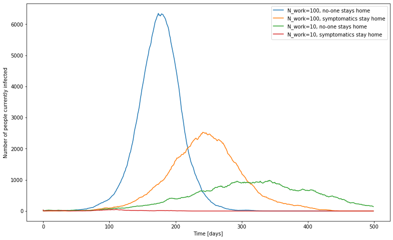

Diseases Transmission Via Homes And Workplaces
==============================================

# Disclaimer

I am **not** an epidemiologist or a medical doctor.
I have *no* domain expertise in the field.

The work in this repository is purely a modelling exercise to investigate whether workplace size **could** be a significant factor in disease transmission.

This work is motivated by COVID-19, but I've made no real effort to make the parameters especially realistic.
You should be careful about drawing any conclusions from this.

# Model

I consider a town with a population of size `N_pop`.
Each person has a workplace and a home.
Every workplace contains `N_work` people, and every home `N_home` people.

Each day, a person has a `beta_work / N_work` probability of being infected by *each* infected person in the same workplace.
Similarly, at home they have a `beta_home / N_home` probability of being infected by *each* infected person in the same home.
The `1 / N_work` and `1 / N_home` factors are to account for the fact that worker in a larger workplace will have contact with a smaller proportion of their colleagues.
Keeping `beta_work` constant and varying `N_work` will keep constant the expected number of colleagues that a single infected worker will infect.

I also include `beta_street` parameter that allows "passing in the street" infections. i.e. the expected number of people that an infected person will infect without workplace or home contact.

Each day an infected person has a (non-constant) probability of recovering, or becoming symptomatic.
The parameter `symptomatics_stay_off_work` controls whether people who have developed symptoms stay away from their workplace, and so do not infect others.

## Workplace condensation

It was pointed out to me that the workplace model (in which I scale down transmission probability with workplace size) is somewhat unrealistic.
You don't have an equal chance of infecting everyone in your workplace - there's certain people (e.g. the person you sit next to) who you have a much higher chance of infecting.

To model this I add the option to enable "workplace condensation".
In this model transmission in the workplace is controlled by a matrix, `W[i, j]`, describing the probability of person `j` transmitting the disease to person `i`.

The `beta_work` parameter still exists and the matrix `W[i, j]` will be chosen such that `sum_i W[i, j] = beta_work`.
i.e. we still keep the expected number of colleagues that will be infected per day constant, in a workplace in which everyone is susceptible.
To derive the `W` matrices we define
```

W[i, j] =  0 if i = j
        =  a + b  if  |i - j| <= lambda_work
        =  a  otherwise
```
We need `b < beta_work / (2 * lambda_work)` to get a positive `a`.

# Results

Is it at least *possible* for workplace size to have a significant effect on transmission?
Yes.

The plot below shows the results of simulations with
```
N_pop = int(1e5)  # Population size
N_home = 2        # Number of people in a home

beta_work = 0.1     # Daily probability of infection if sharing workplace
beta_home = 0.2     # Daily probability of infection if sharing home
beta_street = 0.01  # Random contact on the street, transport, etc.

p_recover = np.array(([0.0] * 3) + ([0.1] * 6) + ([0.2] * 3) + ([0.3]*6) + [1.0])
p_symptomatic = np.array(([0.0] * 3) + ([0.05] * 6) + ([0.1] * 3) + ([0.2]*6) + [0.2])
```
and `N_work` set to either 100 or 10, and `symptomatics_stay_off_work` set to true or false.
These were done using the code in commit `6f15dd2`.



For `N_work` equal to 100, 4 random individuals were initially infected.
For `N_work` equal to 10 this resulted in the disease rapidly dying out - in these cases the curves shown are for 30 initially infected individuals.
